# ADAM GUI - Desktop GUI for the ADAM Breeding Simulator

A modern Python desktop application providing a graphical interface and 3D visualizations for the [ADAM breeding simulator](https://qgg.au.dk/en/research/qgg-big-data-software/adam) from Aarhus University's Center for Quantitative Genetics and Genomics.

ADAM is a Fortran 95 stochastic simulation tool that models selective breeding programs for animals and plants, tracking genetic changes across generations under different breeding scenarios. This GUI wraps the ADAM CLI executable, providing parameter editing, simulation management, result exploration, and interactive 3D visualizations.

## Features

- **Parameter Editor** — Configure all ADAM simulation parameters through an intuitive form-based interface with collapsible sections, validation, and save/load support
- **Simulation Runner** — Execute ADAM simulations with real-time progress tracking, log output, and a run queue for batch comparisons
- **Result Viewer** — Browse simulation results in sortable/filterable tables and 2D charts (genetic gain, variance, inbreeding, selection accuracy, allele frequencies)
- **3D Visualizations** — Four interactive VTK-powered 3D views:
  - **Pedigree Networks** — 3D family trees with lineage highlighting
  - **Chromosome Maps** — Karyogram-style genome visualization with QTL markers and LD ribbons
  - **Population PCA Scatter** — Animated 3D scatter of individuals in genetic principal component space
  - **Genetic Gain Landscapes** — 3D surface plots of breeding progress over time
- **Demo Mode** — Full GUI exploration with synthetic data when ADAM executable is not installed

## Screenshots

### Parameter Editor
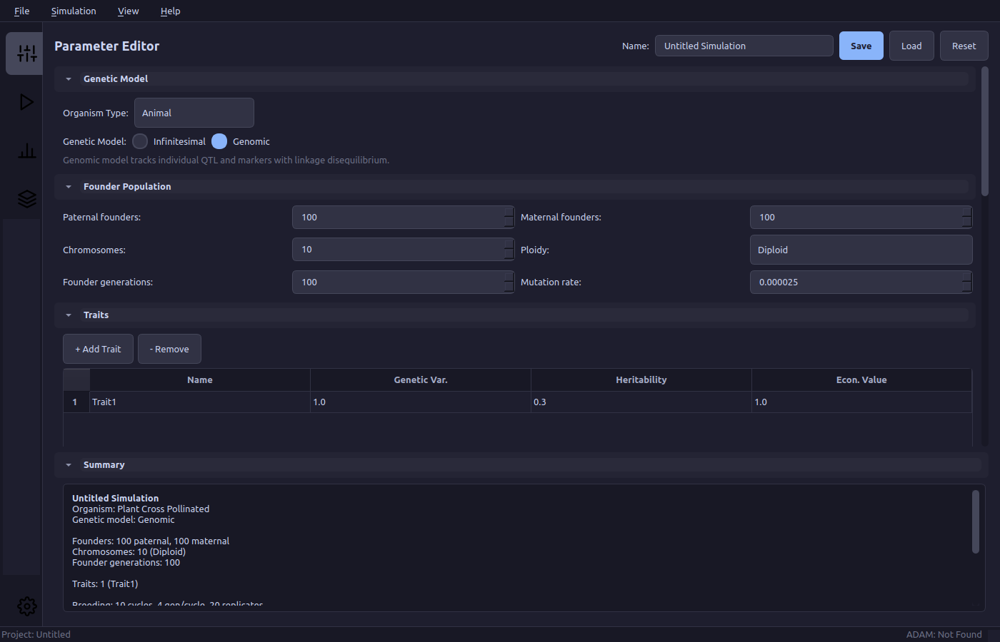

### Results Summary
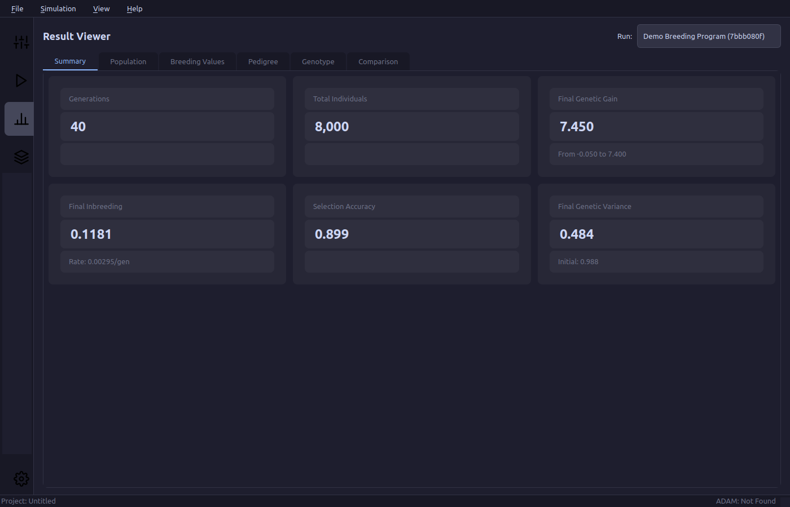

### Population Charts
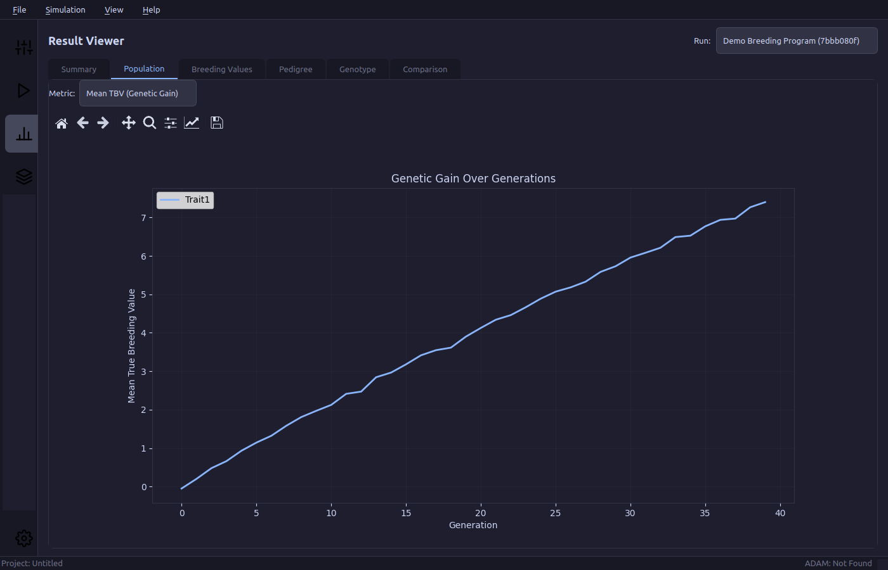

### Breeding Values Table
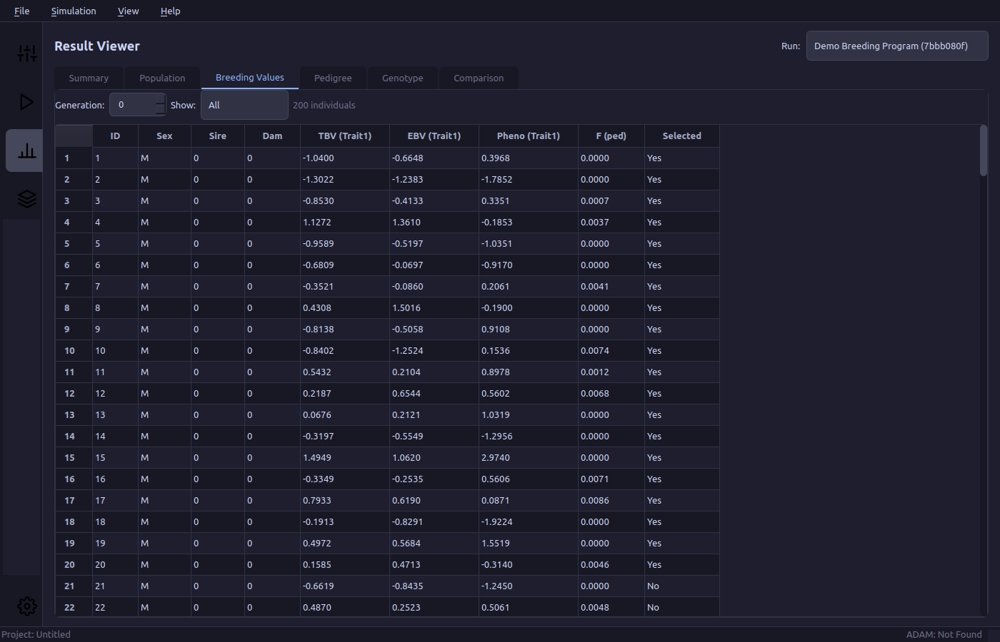

### Pedigree Browser
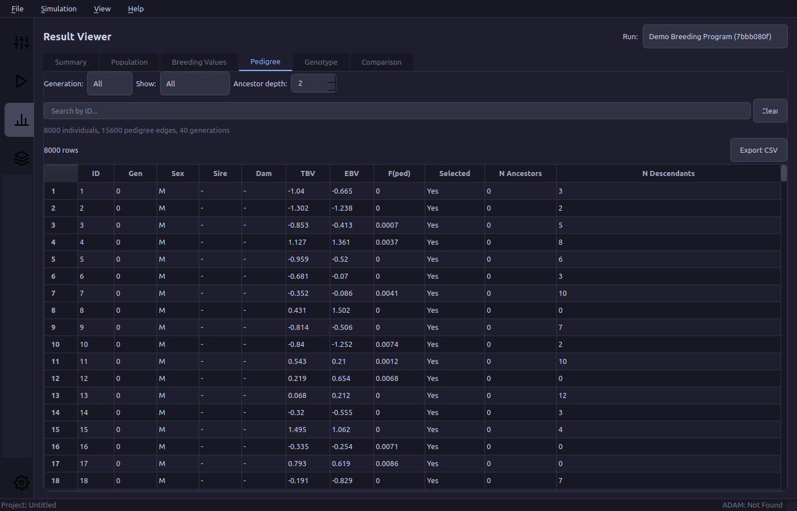

### Genotype Heatmap
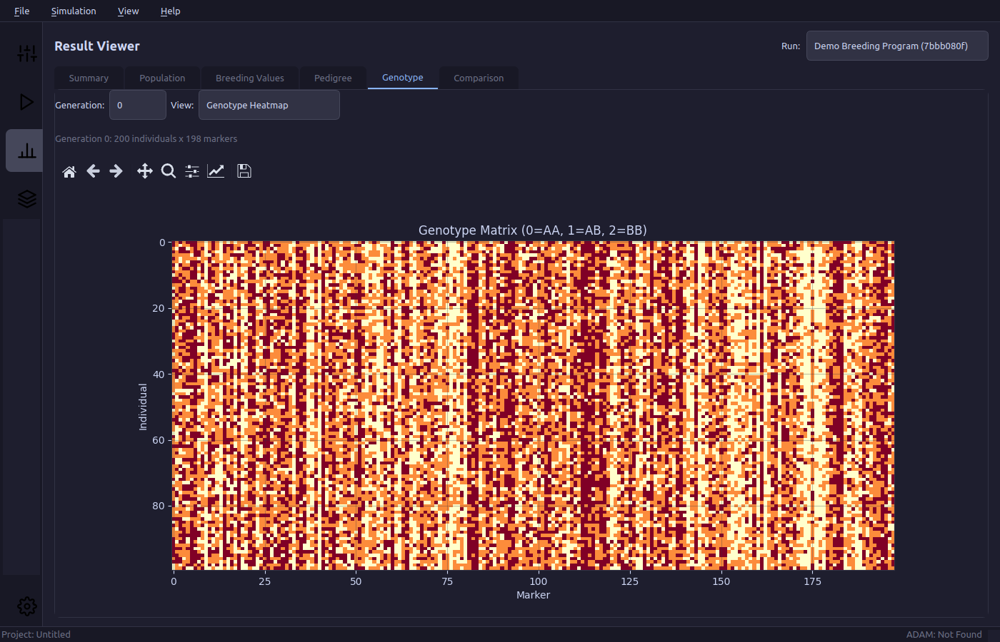

### Multi-Run Comparison
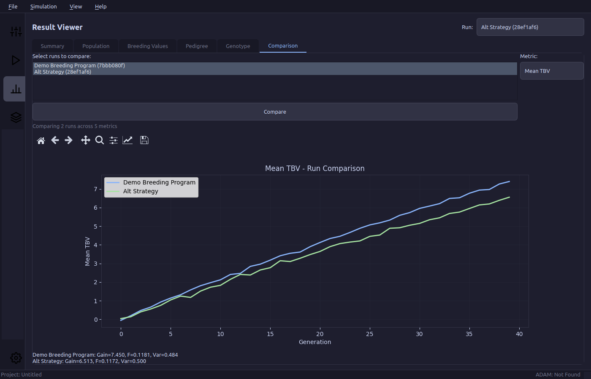

### 3D Visualization Hub
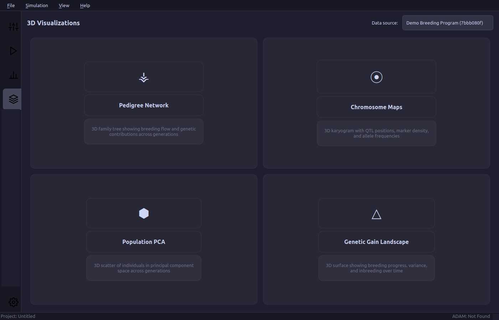

### 3D Pedigree Network
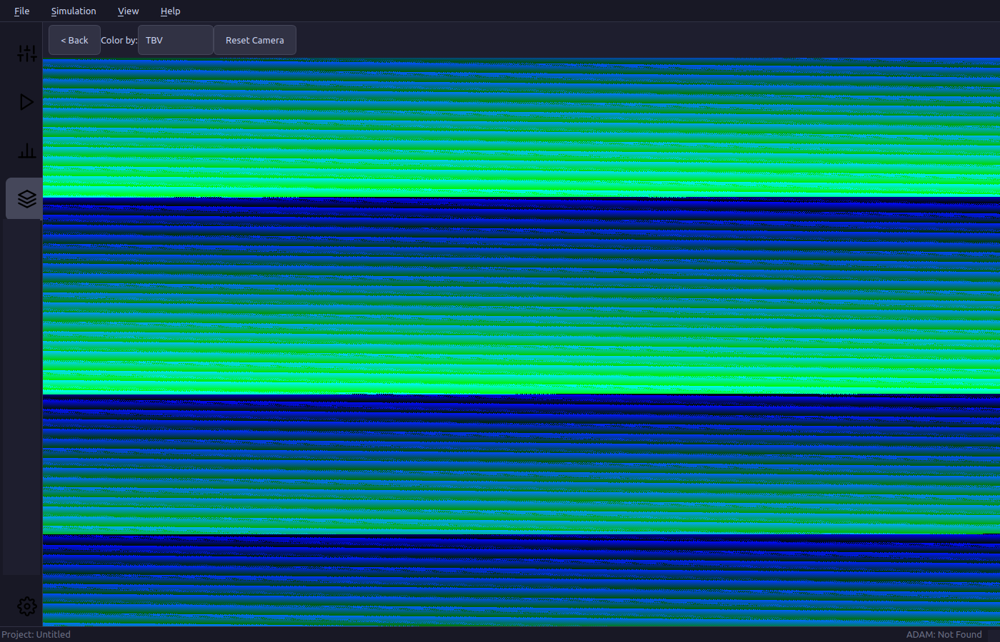

### 3D Chromosome Map
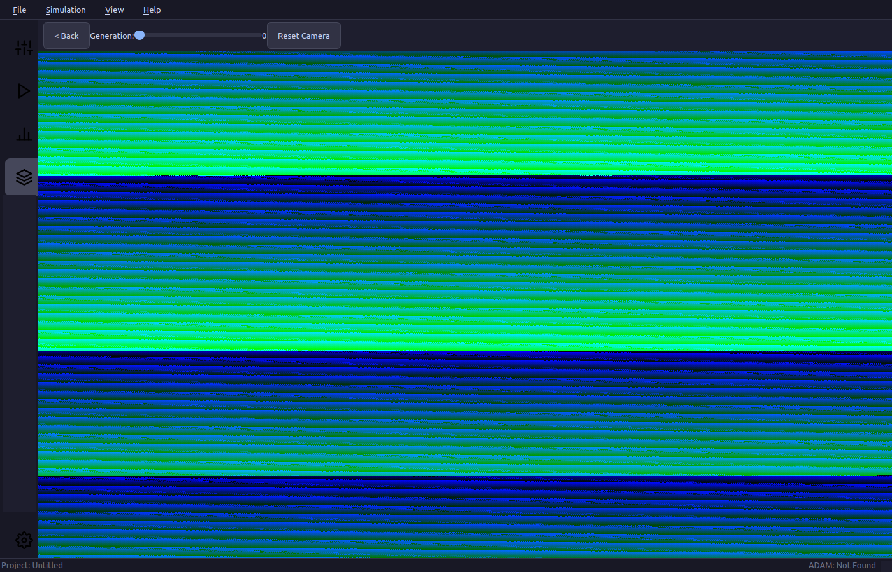

### 3D PCA Scatter


### 3D Genetic Gain Landscape
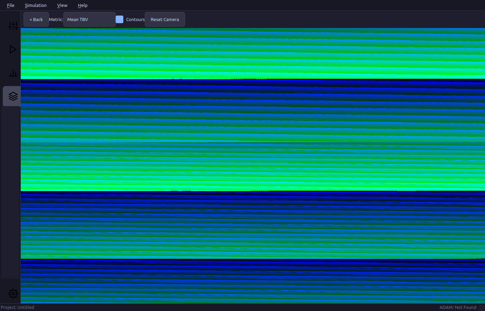

### Light Theme
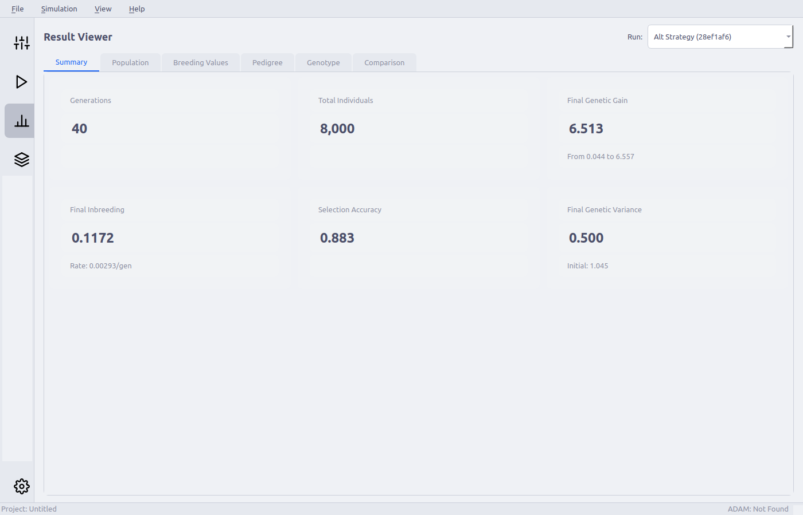

## Tech Stack

| Component | Technology |
|-----------|-----------|
| GUI Framework | PyQt6 (PySide6 fallback) |
| 3D Rendering | VTK 9.3+ |
| 2D Charts | Matplotlib, pyqtgraph |
| Data Processing | NumPy, Pandas, SciPy |
| PCA Computation | scikit-learn |
| Architecture | MVC with Qt signals/slots |

## Installation

```bash
# Clone the repository
git clone https://github.com/jakobrichert/adam-gui.git
cd adam-gui

# Create a virtual environment
python3 -m venv venv
source venv/bin/activate

# Install dependencies
pip install -r requirements.txt

# Run the application
python run.py
```

### Requirements

- Python 3.10+
- Linux (primary target, matching ADAM's platform)
- ADAM executable (optional — demo mode works without it)

## Project Structure

```
adam-gui/
├── run.py                          # Application entry point
├── pyproject.toml                  # Project metadata and dependencies
├── requirements.txt                # Pip-installable dependencies
│
└── adam_gui/                       # Main Python package
    ├── app.py                      # QApplication setup, theme, global config
    ├── main_window.py              # QMainWindow: menu bar, sidebar, stacked views
    ├── constants.py                # App-wide constants, defaults, color palettes
    ├── qt_compat.py                # PyQt6/PySide6 compatibility shim
    │
    ├── models/                     # Data model layer (pure Python, no Qt)
    │   ├── enums.py                # GeneticModel, SelectionStrategy, PropagationMethod, etc.
    │   ├── parameters.py           # SimulationParameters dataclass hierarchy
    │   ├── results.py              # SimulationResults, GenerationSummary, GenotypeData
    │   ├── pedigree.py             # PedigreeNode, PedigreeTree with graph traversal
    │   ├── genetic_data.py         # GenotypeMatrix, HaplotypeMatrix, AlleleFrequencyTracker
    │   └── project.py              # Project (bundles params + results + comparisons)
    │
    ├── services/                   # Business logic and ADAM integration
    │   ├── adam_runner.py          # Subprocess management, execute ADAM, stream output
    │   ├── param_writer.py         # Serialize parameters to ADAM text format
    │   ├── output_parser.py        # Parse ADAM output directory into result models
    │   ├── file_formats.py         # Low-level parsers for each ADAM output file type
    │   ├── pca_compute.py          # PCA from genotype matrices (scikit-learn)
    │   ├── comparison.py           # Multi-run comparison and alignment logic
    │   ├── project_io.py           # Save/load .adam-project bundles
    │   └── demo_data.py            # Synthetic data generator for demo mode
    │
    ├── widgets/                    # Reusable Qt widgets
    │   ├── collapsible_section.py  # Animated collapsible parameter group
    │   ├── range_slider.py         # Dual-handle range slider
    │   ├── search_bar.py           # Filterable search input with debounce
    │   ├── status_indicator.py     # LED-style colored status dot
    │   ├── file_picker.py          # Path selector with browse button
    │   ├── data_table.py           # Sortable/filterable QTableView for DataFrames
    │   ├── vtk_widget.py           # QVTKRenderWindowInteractor wrapper
    │   ├── chart_widget.py         # Matplotlib canvas embedded in Qt
    │   ├── toolbar.py              # Custom icon toolbar
    │   └── loading_overlay.py      # Translucent spinner overlay
    │
    ├── views/                      # Major UI panels
    │   ├── parameter_editor/       # Parameter configuration UI
    │   │   ├── editor_view.py      # Main editor with scroll + collapsible sections
    │   │   ├── genetic_model_panel.py
    │   │   ├── founder_panel.py
    │   │   ├── breeding_panel.py
    │   │   ├── trait_panel.py
    │   │   ├── selection_panel.py
    │   │   ├── propagation_panel.py
    │   │   ├── output_panel.py
    │   │   ├── advanced_panel.py
    │   │   └── summary_panel.py
    │   │
    │   ├── simulation_runner/      # Simulation execution UI
    │   │   ├── runner_view.py
    │   │   ├── queue_table.py
    │   │   ├── progress_panel.py
    │   │   └── executable_config.py
    │   │
    │   ├── result_viewer/          # Result browsing UI
    │   │   ├── viewer_view.py
    │   │   ├── summary_tab.py
    │   │   ├── breeding_values_tab.py
    │   │   ├── population_tab.py
    │   │   ├── pedigree_tab.py
    │   │   ├── genotype_tab.py
    │   │   └── comparison_tab.py
    │   │
    │   ├── visualizations/         # 3D visualization views
    │   │   ├── viz_hub.py          # Gallery launcher for 4 viz types
    │   │   ├── pedigree_3d.py
    │   │   ├── chromosome_3d.py
    │   │   ├── pca_scatter_3d.py
    │   │   └── landscape_3d.py
    │   │
    │   └── charts/                 # 2D chart views
    │       ├── genetic_gain_chart.py
    │       ├── variance_chart.py
    │       ├── inbreeding_chart.py
    │       ├── accuracy_chart.py
    │       ├── allele_freq_chart.py
    │       └── comparison_chart.py
    │
    ├── vtk_pipelines/              # VTK rendering logic (separated from Qt)
    │   ├── common.py               # VTKSceneBase, shared helpers, color maps
    │   ├── pedigree_pipeline.py    # 3D pedigree graph layout and rendering
    │   ├── chromosome_pipeline.py  # Ideogram rendering with QTL/marker overlays
    │   ├── scatter_pipeline.py     # PCA point cloud with animation
    │   └── surface_pipeline.py     # Genetic gain surface mesh with contours
    │
    ├── controllers/                # MVC controllers
    │   ├── parameter_controller.py
    │   ├── runner_controller.py
    │   ├── result_controller.py
    │   ├── visualization_controller.py
    │   └── project_controller.py
    │
    ├── themes/                     # UI themes
    │   ├── theme_manager.py
    │   ├── dark.qss
    │   └── light.qss
    │
    ├── assets/                     # Static resources
    │   ├── icons/                  # SVG icons
    │   └── images/                 # Splash screen, etc.
    │
    └── tests/                      # Test suite (41 tests)
        ├── conftest.py             # Shared fixtures
        ├── test_parameters.py      # Parameter model round-trip tests
        ├── test_pedigree.py        # Pedigree tree traversal tests
        ├── test_demo_data.py       # Demo data generator tests
        ├── test_pca_compute.py     # PCA computation tests
        ├── test_services.py        # ParamWriter, Comparison, ProjectIO tests
        └── fixtures/               # Sample ADAM output files (TODO)
```

## Architecture

### MVC Pattern

```
User interacts with View
  → View emits Qt signal (parameterChanged, runRequested, ...)
  → Controller receives signal
  → Controller updates Model (pure Python dataclasses)
  → Model change propagated to other Views via Controller
```

### Threading Model

- **Main thread**: All Qt UI operations, VTK rendering
- **Worker threads (QThread)**: ADAM subprocess execution, output file parsing, PCA computation
- **Communication**: Qt signals/slots across threads

### Data Flow

```
Parameter Editor → SimulationParameters → param_writer → ADAM param file
                                                              ↓
                                                        adam_runner (subprocess)
                                                              ↓
ADAM output files → output_parser → SimulationResults → Result Viewer / Charts
                                          ↓
                                   pca_compute → VTK Pipelines → 3D Visualizations
```

## Detailed Data Model

### SimulationParameters

Nested dataclasses covering the full ADAM configuration:

| Component | Fields |
|-----------|--------|
| **FounderPopulation** | N paternal/maternal, chromosomes, loci per chromosome, QTL count, mutation rate, ploidy level |
| **TraitSpec** | Name, genetic variance, heritability, economic value, plot size |
| **SelectionConfig** | Strategy (phenotypic/BLUP/GBLUP/Bayesian/OCS), unit (individual/family), truncation proportions, multi-stage |
| **PropagationConfig** | Method (cloning/crossing/selfing/doubled-haploid), crossing scheme, offspring per cross, speed breeding |
| **BreedingProgram** | Cycles, generations per cycle, replicates, overlapping cycles |
| **OutputConfig** | Toggles for haplotypes, genotypes, pedigree, breeding values, metrics, inbreeding |

### SimulationResults

| Component | Description |
|-----------|------------|
| **IndividualRecord** | Per-individual data: ID, generation, parents, TBV, EBV, phenotype, inbreeding, selection status |
| **GenerationSummary** | Per-generation aggregates: mean TBV/EBV, genetic variance, inbreeding rate, selection accuracy |
| **GenotypeData** | NumPy arrays: genotype matrix (n_individuals x n_markers), chromosome indices, marker positions |
| **QTLInfo** | Chromosome, position, allele effects, allele frequencies per generation |
| **PedigreeTree** | Graph structure with traversal: ancestors(), descendants(), subpedigree() |

## 3D Visualization Details

### 1. Pedigree Network (VTK)

```
PedigreeTree
  → vtkMutableDirectedGraph (nodes=individuals, edges=parent→child)
  → Custom 3D layered layout (X=within-gen, Y=generation, Z=family cluster)
  → Nodes: vtkGlyph3D + vtkSphereSource (size ∝ selection status)
  → Edges: vtkTubeFilter (width ∝ genetic contribution)
  → Color: vtkLookupTable mapped to TBV or inbreeding coefficient
  → Interaction: click node → highlight full ancestry/progeny lineage
  → Controls: generation range slider, color-by dropdown, camera reset
```

**Scalability**: LOD rendering via `vtkLODActor` for >5000 individuals.

### 2. Chromosome Maps (VTK)

```
ChromosomeSpec + QTLInfo + MarkerInfo
  → Chromosome bodies: vtkCylinderSource per chromosome (karyogram layout)
  → QTL markers: vtkSphereSource at positions (color=effect size, size=|effect|)
  → Marker density: heat-strip along chromosome surface (vtkColorTransferFunction)
  → LD ribbons: vtkSplineFilter + vtkRibbonFilter between linked loci
  → Animation: allele frequency coloring changes across generations
```

### 3. Population PCA Scatter (VTK)

```
GenotypeData per generation
  → sklearn PCA (3 components)
  → vtkPoints → vtkPolyData → vtkGlyph3D (or vtkPointGaussianMapper for large N)
  → Color by: generation (rainbow), TBV (diverging), family (categorical)
  → Animation: interpolate positions between generation snapshots
  → Trails: vtkPolyLine connecting same individual across generations
  → Centroid: large transparent sphere at population mean
```

### 4. Genetic Gain Landscape (VTK)

```
GenerationSummary list (single or multi-run)
  → vtkStructuredGrid (X=generation, Y=replicate/run, Z=metric value)
  → vtkDataSetMapper with color transfer function
  → Contour lines: vtkContourFilter
  → Wireframe overlay option
  → Dual-surface mode: show gain + inbreeding simultaneously with transparency
```

## UI Layout

### Main Window
```
+--------------------------------------------------------------+
| Menu Bar: File | Edit | Simulation | View | Help             |
+------+---------------------------------------------------+---+
|      |                                                   |   |
| NAV  |           CENTRAL CONTENT AREA                    |   |
|      |         (QStackedWidget)                          |   |
| [P]  |                                                   |   |
| [R]  |  Active Page Content                              |   |
| [V]  |                                                   |   |
| [3D] |                                                   |   |
| ---  |                                                   |   |
| [S]  |                                                   |   |
|      |                                                   |   |
+------+---------------------------------------------------+---+
| Status: [ADAM: Connected/Not Found]  [Project: name]         |
+--------------------------------------------------------------+

P=Parameters  R=Runner  V=Results  3D=Visualizations  S=Settings
```

### 3D Visualization Hub
```
+-----------------------------------------------+
| Select data source: [Dropdown: run_1 | run_2] |
+-----------------------------------------------+
| +------------------+ +------------------+     |
| | [Pedigree icon]  | | [Chromosome icon]|     |
| | 3D Pedigree      | | Chromosome Maps  |     |
| | Network          | |                  |     |
| +------------------+ +------------------+     |
|                                               |
| +------------------+ +------------------+     |
| | [Scatter icon]   | | [Landscape icon] |     |
| | Population PCA   | | Genetic Gain     |     |
| | Scatter          | | Landscape        |     |
| +------------------+ +------------------+     |
+-----------------------------------------------+
```

## Implementation Status

| Phase | Scope | Status |
|-------|-------|--------|
| **1. Foundation** | Project scaffold, data models, main window, themes | Done |
| **2. Parameter Editor** | All 9 parameter panels, save/load, collapsible sections | Done |
| **3. ADAM Integration** | Subprocess runner, progress, demo data generator | Done |
| **4. Result Viewer** | Output parser, 6 tabs (summary, population, breeding values, pedigree, genotype, comparison), 6 chart types | Done |
| **5. Comparison** | Multi-run comparison service, comparison tab and chart | Done |
| **6. 3D Visualizations** | 4 VTK pipelines + views (pedigree, chromosome, PCA scatter, landscape) | Done |
| **7. Polish** | Test suite (41 tests passing) | Partial |

### Remaining Work

The core application is functional. The following items are still TODO:

**Not yet implemented:**
- `controllers/` — The 5 MVC controller files listed in the project structure. Currently, signal wiring is done directly in `app.py`. Refactoring into controllers would improve separation of concerns but is not blocking functionality.
- `views/simulation_runner/queue_table.py`, `progress_panel.py`, `executable_config.py` — Runner sub-components. Currently all runner functionality lives in `runner_view.py`.
- `widgets/toolbar.py` — Custom toolbar widget. Currently using inline QToolBar.
- `assets/images/` — Splash screen and marketing images.
- Sample ADAM output files in `tests/fixtures/` for integration testing the output parser against real data.

**Needs testing / polish:**
- VTK rendering on systems with GPU/display (developed headless — the offscreen Qt platform causes VTK core dumps, but should work fine on a real display).
- Light theme chart colors (charts currently hardcoded to dark theme palette).
- Keyboard shortcuts beyond Ctrl+1-4 navigation.
- Large dataset performance profiling (LOD rendering for >5000 nodes).
- Window state persistence (geometry, splitter positions).
- Error handling audit (graceful fallbacks for missing ADAM executable, corrupt files, etc.).

## About ADAM

ADAM was developed at the [Center for Quantitative Genetics and Genomics](https://qgg.au.dk/en/), Aarhus University, Denmark.

Key references:
- [ADAM-Plant (Frontiers, 2019)](https://pmc.ncbi.nlm.nih.gov/articles/PMC6333911/) — Stochastic simulations of plant breeding
- [ADAM-Multi (Frontiers, 2025)](https://www.frontiersin.org/journals/genetics/articles/10.3389/fgene.2025.1513615/full) — Multi-allelic, polyploid support
- [ADAM software page](https://qgg.au.dk/en/research/qgg-big-data-software/adam)

## License

MIT
