# ADAM GUI

A desktop app for setting up, running and exploring breeding-programme simulations with
[ADAM](https://qgg.au.dk/en/research/qgg-big-data-software/adam), the stochastic breeding simulator
from the Center for Quantitative Genetics and Genomics, Aarhus University.

It has a guided setup editor, a run manager, interactive results and four 3D views. A small built-in
demo simulator lets you try all of it without ADAM installed.

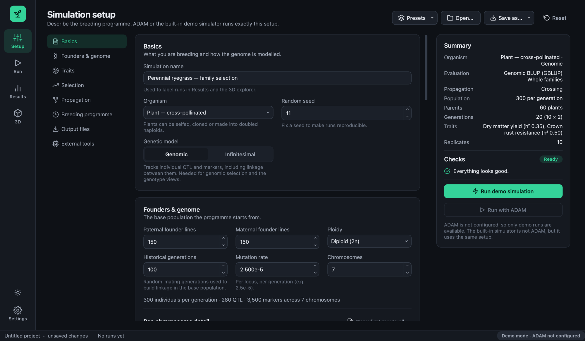

## Features

**Setup**
- Every ADAM section in one form: basics, founders and per-chromosome genome, traits and trait
  correlations, selection, propagation, programme length, output files and external tools.
- A live summary with checks that point to the exact field (for example heritability of 0, no
  selected males, or genomic selection with the infinitesimal model).
- Presets for dairy cattle, pig OCS, wheat doubled-haploid lines and perennial ryegrass.
- Parameters load and save as `.adam-params`, and can be exported as an ADAM text parameter file.

**Run**
- Run with ADAM or with the built-in demo simulator. Several demo replicates can run in one go.
- Live progress, a stop button, a run history and a copyable log.
- Each ADAM run gets its own folder containing the parameter file, `adam.log` and the output files.

**Results**
- **Overview:** headline numbers (genetic gain, gain per generation, variance change, accuracy,
  pedigree and genomic inbreeding, effective population size) and trend charts.
- **Trends:** genetic gain with EBV and phenotype, variance components, inbreeding, accuracy, and QTL
  allele-frequency trajectories.
- **Individuals:** a fast, sortable and filterable table of every individual, with CSV export.
- **Pedigree:** ancestry tree and descendant counts for any individual, plus family statistics.
- **Genotypes:** marker heatmap, allele-frequency spectrum, minor allele frequency, and allele-frequency
  change between generations.
- **Compare:** any combination of runs side by side, with an outcomes table.

**3D Explorer**
- **Pedigree network:** click an individual to trace its ancestors and descendants.
- **Chromosome map:** QTL effects and favourable-allele frequencies. Press play to watch selection
  change them generation by generation.
- **Population PCA:** all stored generations in one shared principal-component space, showing drift over
  time.
- **Value landscape:** how the distribution of breeding values (or inbreeding) shifts and narrows.

**General**
- Projects (`.adam-project`) bundle the setup and all runs.
- Dark and light themes, or follow the system setting.
- Keyboard shortcuts, remembered window layout, and a recent-projects list.

## Screenshots

| | |
|---|---|
| 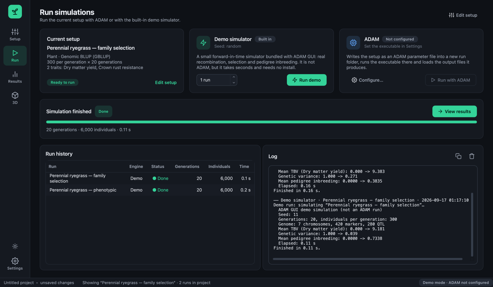 | 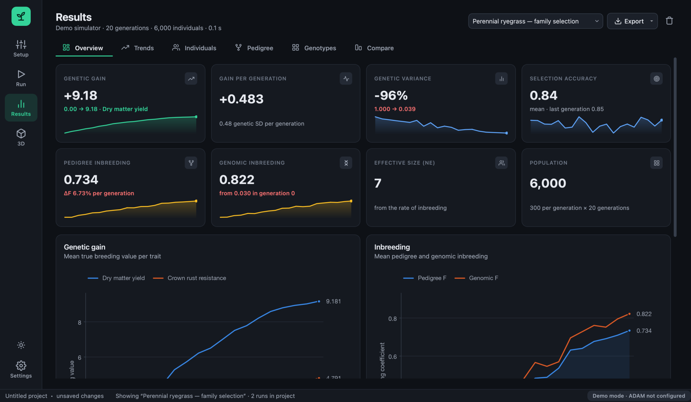 |
| **Run**: engines, progress, history and log | **Results → Overview** |
| 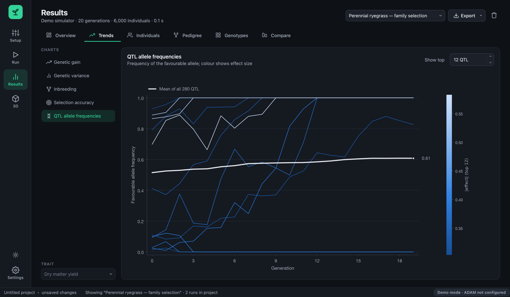 | 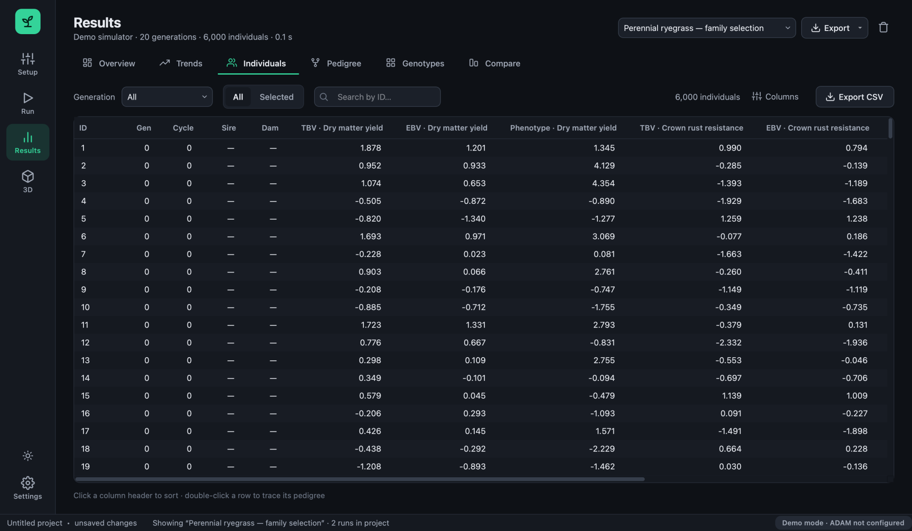 |
| **Trends**: QTL allele frequencies | **Individuals** |
| 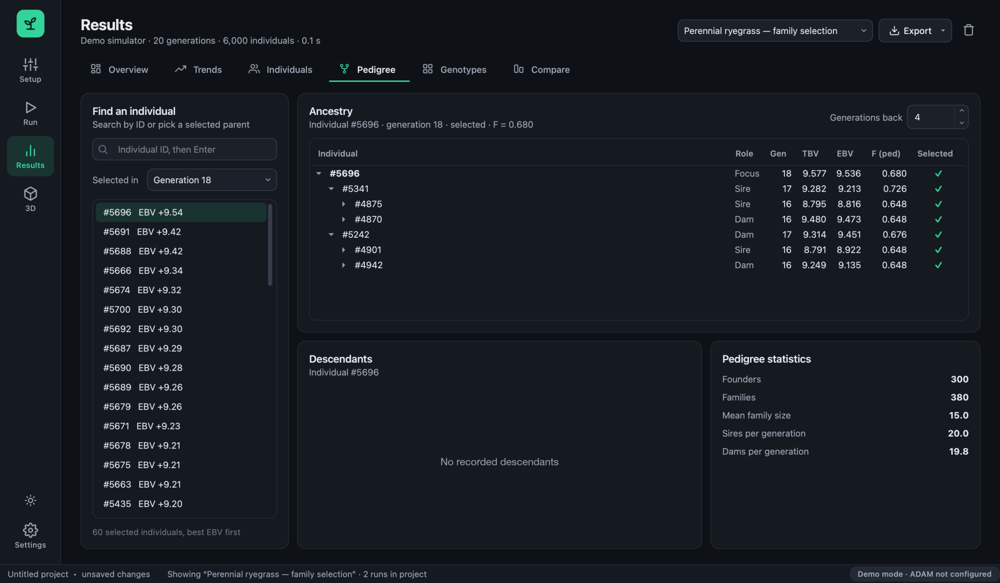 | 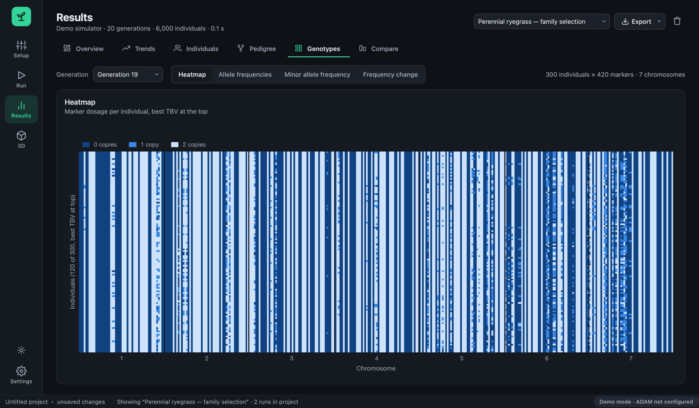 |
| **Pedigree** explorer | **Genotypes** heatmap |
| 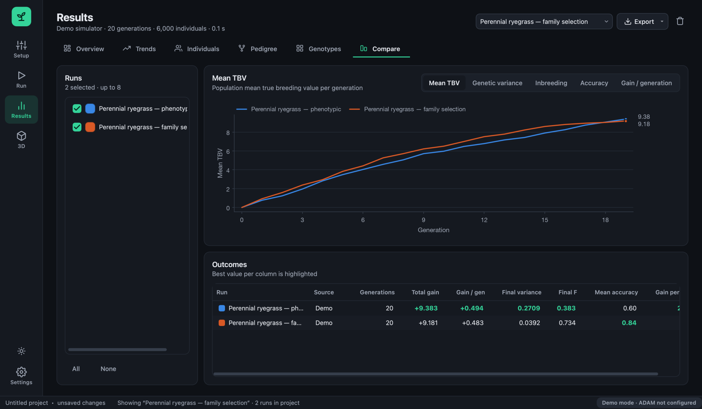 | 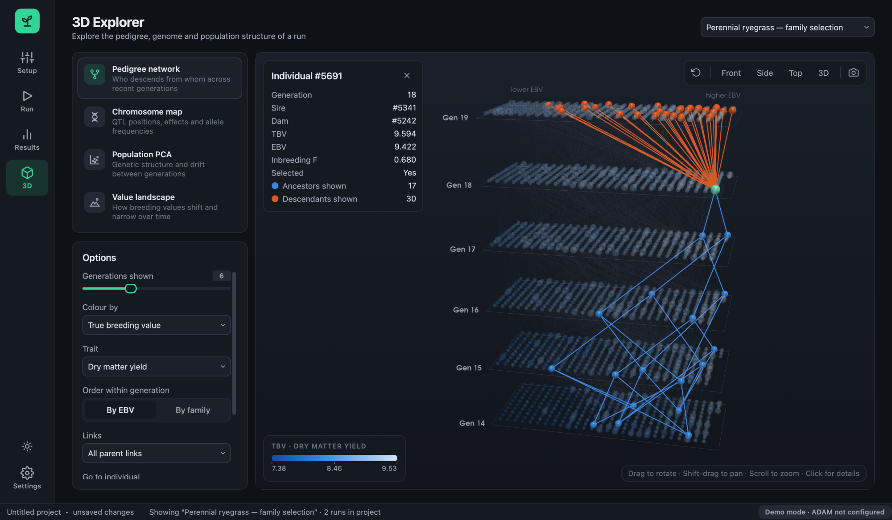 |
| **Compare** runs | **3D pedigree** with a traced lineage |
| 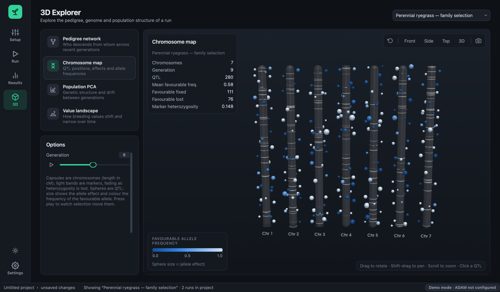 | 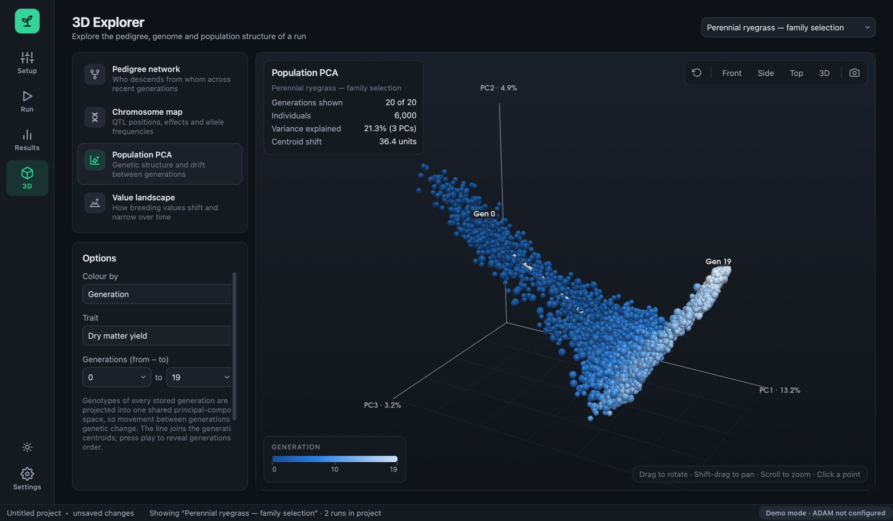 |
| **3D chromosome map** | **3D population PCA** |
| 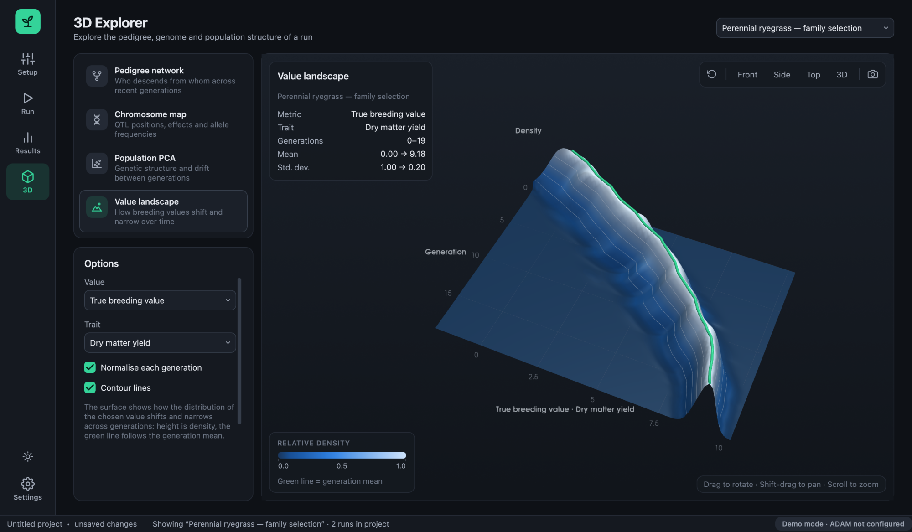 | 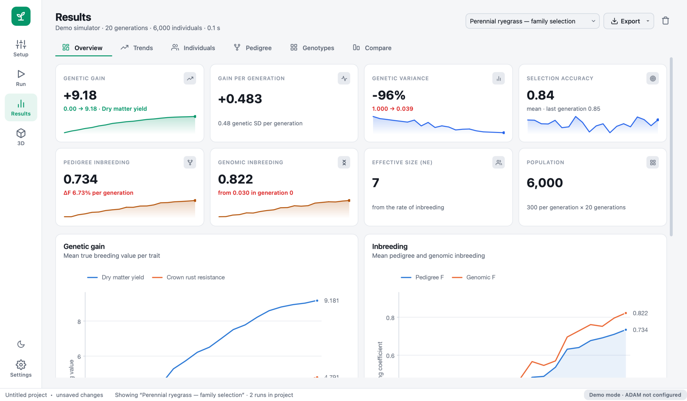 |
| **3D value landscape** | Light theme |

## Getting started

Requires Python 3.10 or newer. Developed and tested on macOS 26 (Apple silicon) with Python 3.12,
PyQt6 6.11 and VTK 9.7. Linux and Windows should work (nothing is macOS-specific) but have not been
tested yet.

```bash
git clone https://github.com/jakobrichert/adam-gui.git
cd adam-gui
python3 -m venv .venv
source .venv/bin/activate        # Windows: .venv\Scripts\activate
pip install -r requirements.txt
python run.py                    # or: python -m adam_gui
```

With [uv](https://docs.astral.sh/uv/): `uv venv && uv pip install -r requirements.txt && uv run python run.py`.

### A two-minute tour

1. **Setup:** pick *Presets → Perennial ryegrass* (or keep the defaults).
2. Click **Run demo simulation**. It takes well under a second, and the Results page opens.
3. Browse the tabs, then open **3D**. Click a sphere in the pedigree network to trace its lineage.
4. Back on **Run**, set *2 runs*, change the strategy in Setup, and run again. **Results → Compare**
   now has something to compare.
5. Press **Ctrl+S** to save everything as a project.

## Using ADAM

1. Get ADAM from Aarhus University (see the
   [software page](https://qgg.au.dk/en/research/qgg-big-data-software/adam)).
2. In **Settings → ADAM simulator**, choose the executable. You can also set the `ADAM_EXECUTABLE`
   environment variable.
3. Adjust **Command-line arguments** if your ADAM build expects something other than the parameter file
   path. `{param_file}` and `{work_dir}` are substituted.
4. Click **Run with ADAM**. The app writes `parameters.txt` into a new run folder, runs ADAM there,
   streams its output into the log, and loads the result files when it finishes.

You can also load existing output with **File → Import ADAM Results Folder…**.

> **Status of the ADAM integration.** ADAM's parameter-file syntax and output file layout are not
> publicly documented. The writer (`services/param_writer.py`) and parsers (`services/file_formats.py`)
> follow the structure described in the ADAM papers, and the parsers recognise several common file
> names. They have not been verified against a real ADAM binary. If your ADAM version uses different
> keywords or file names, those two modules are the only places to change. Everything else (setup,
> results and 3D) works on the shared data model.

### The demo simulator

`services/demo_data.py` is a compact forward-in-time simulator that runs the same setup:
- recombining diploid genomes;
- additive QTL traits scaled to the requested genetic variance;
- phenotypes from heritability;
- EBVs with strategy-dependent accuracy;
- selection by individual, within family, whole family or OCS;
- crossing, selfing, cloning and doubled haploids;
- exact pedigree inbreeding and genomic inbreeding.

It exists so the interface can be explored and tested without ADAM. **It is not ADAM, and its
numbers are not a substitute for ADAM results.** Runs from it are labelled "Demo simulator"
throughout the app.

## Keyboard shortcuts

| Shortcut | Action |
|---|---|
| Ctrl+1 … Ctrl+4 | Setup, Run, Results, 3D |
| Ctrl+, | Settings |
| Ctrl+Shift+R / Ctrl+R | Run demo / Run with ADAM |
| Ctrl+. | Stop the running simulation |
| Ctrl+N / Ctrl+O / Ctrl+S / Ctrl+Shift+S | New, Open, Save, Save As project |
| Ctrl+I | Import an ADAM results folder |
| Ctrl+Shift+L | Toggle light/dark theme |
| R / F / T (3D view focused) | Reset / front / top camera |

On macOS, Ctrl means ⌘.

## Development

```bash
pip install -r requirements-dev.txt
python -m pytest              # 130 tests: models, services, simulator, every page (headless)
ruff check adam_gui
python capture_screenshots.py # regenerate README screenshots (add --offscreen on headless machines)
```

The UI tests run with `QT_QPA_PLATFORM=offscreen`. The 3D views render through an offscreen VTK
window, so they also work headless.

### Project layout

```
adam_gui/
├── app.py                 # QApplication: builds the window, wires pages, project/file actions
├── main_window.py         # sidebar navigation, page stack, menus, status bar
├── session.py             # the open project: parameters, runs, current run, dirty flag (signals)
├── settings.py            # typed QSettings (ADAM path, run folder, theme, recent projects)
├── icons.py               # inline SVG icon set, recoloured per theme
├── themes/                # palettes, generated stylesheet, colour scales for charts and 3D
├── models/                # dataclasses: parameters, results, pedigree, project
├── services/              # ADAM runner, parameter writer, output parsers, demo simulator,
│                          # validation, project I/O, run comparison
├── widgets/               # UI kit (cards, KPI cards, empty states, toasts…), chart widget,
│                          # fast data table, file picker, run selector, offscreen VTK canvas
├── views/
│   ├── parameter_editor/  # setup page: sections, presets, live summary
│   ├── simulation_runner/ # run page and background workers
│   ├── result_viewer/     # results page and its six tabs
│   ├── visualizations/    # 3D explorer: workspace, controls, overlays
│   └── settings_view.py
├── vtk_pipelines/         # the four 3D scenes
└── tests/
```

**Why an offscreen VTK canvas?** On macOS with Qt 6 and VTK 9.4+, VTK's own
`QVTKRenderWindowInteractor` hangs as soon as it paints. It also can't have Qt widgets drawn on top of
it or be captured with `QWidget.grab()`. `widgets/vtk_canvas.py` instead renders offscreen, copies the
frame into a normal widget (about 5–10 ms at Retina resolution), and forwards mouse, wheel and trackpad
gestures to VTK.

## About ADAM

ADAM was developed at the [Center for Quantitative Genetics and Genomics](https://qgg.au.dk/en/),
Aarhus University, Denmark. This project is an independent front end and is not affiliated with
Aarhus University.

- Pedersen, L.D. et al. (2009). ADAM: A computer program to simulate selective breeding schemes for
  animals. *Livestock Science* 121, 343–344.
- Liu, H. et al. (2019). [ADAM-Plant](https://www.frontiersin.org/journals/plant-science/articles/10.3389/fpls.2018.01926/full):
  a software for stochastic simulations of plant breeding. *Frontiers in Plant Science* 9, 1926.
- [ADAM-Multi](https://pmc.ncbi.nlm.nih.gov/articles/PMC11847855/): multi-allelic and polyploid
  breeding programmes.

## License

MIT. Icons are adapted from [Feather](https://feathericons.com) (MIT) and [Lucide](https://lucide.dev) (ISC).
